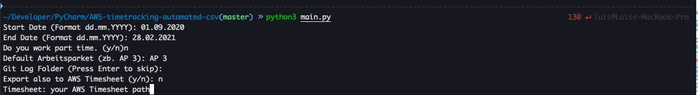

# Timetracking Automation from csv

*Important Notice*
Latest Version isn't tested and documentation isn't up to date. 
Try it a few times before sending it out.

## Setup

```bash
pip3 install -r requirements.txt
```

## CSV Export

Open the commandline.
Run with python >= 3.9:
```bash
python3 main.py
```

Now answer all questions:



If you worked with different hourly rates during the period, run the program with a different hourly rate for each period.
For example: you worked 20 hours, from 01.09.2020 to 31.01.2020. And then you worked 25 hours.
Run the program twice, with these inputs.

If you don't know which WorkPackage/"Arbeitspaket" is you main one. Please ask.

**Git Logs**

If you worked with Git Repos, you can add all the git logs as your Remark/summary.
Create an empty folder and put all your git log files in there.
To get the log files run this for every git repo you have worked in: 

`./gitlog.sh <pathToGitRepo>`
if you don't input a path it will use the current directory.
As output you get a file named something like log_export_*.csv. 
Move all of them into a single folder. 

Specify the folder while the program is running:


## AWS Export - Extra

Open the aws excel sheet where you want to insert the time tracking. 
Open also the correct spreadsheet. Click in a writable cell!
Important...Dont close excel. it needs to be open...
Then just start the application! 
